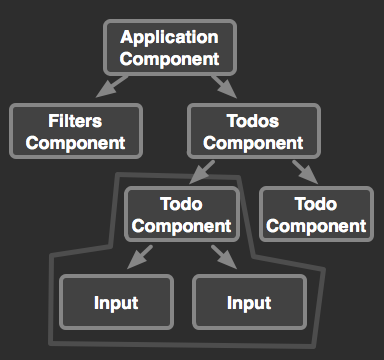

# Angular2的函数式编程

本文来自于 [Better Support for Functional Programming in Angular 2](http://victorsavkin.com/post/108837493941/better-support-for-functional-programming-in)

本文将讨论[Angular2]()带来的变化，以及对函数式编程的支持情况。

> Angular2目前依然处于开发阶段，还没有稳定。所以本文的例子可能会随时变化。但请不要在意这些细节，把关注点放在功能和理论的讨论上，而不揪着API不放。

## 为什么要使用函数式编程？

想象程序是由一个个嵌套组件构成的，所以组件应该具备下面的特点：

* 组件只决定于自身值绑定和他的子组件
* 组件只能影响他的子组件



比如，`Todo Component`就不应该影响除了`Input`外的任何其他组件。

如果按照这个方式来写我们的程序，就会发现一点：

我们更应该关注每个组件自身的实现，降低组件间的耦合程度，还不是去关心他被使用的具体环境。换句话说，应当仅仅通过查看他的代码和模板就可以推敲出这个组件的功能。

利用函数式编程，我们就可以实现对可变状态的控制。

## 面向数据编程

通常情况下，当我们使用`model`时，我们说组件中的`model`也是可变的，因为当`model`被更新后，引用`model`的其他组件也会被同时更新。

而函数式编程却恰恰相反，他使用不可变数据结构，充当我们的`model`，然后利用**map** **filter** **reduce** 来改变他们。

> 不可变意味着函数操作会返回一个数据副本，还不是直接修改数据本身。

> map filter reduce 是函数式编程中三个最重要的函数，分别代表了转换，过滤，以及聚合。

Angular2没有使用KVO（Key-Value-Observing），而是用**脏值检查**的机制来代替属性绑定。

这样我们就不需要在数据外套一层Get/Set的壳子，直接为`model`赋值就可以了，像下面这样：

> KVO是一种观察者机制，就是说当属性被修改后，响应的观察者会得到通知。这个机制可以用来实现数据绑定。

> 脏值检查和KVO一样，也是实现数据绑定的一种机制。Angular2中脏值检查使用[zone.js]((https://github.com/angular/zone.js))库来实现。

```typescript
class TodosComponent {
  constructor(http:Http) {
    this.todos = [];

    http.get("/todos").
      then((resp) => {
        this.todos = resp.map((todo) =>
          replaceProperty(todo, "date", humanizeDate))
      });
  }

  checkAll() {
    this.todos = this.todos.map((todo) =>
      replaceProperty(todo, 'checked', true));
  }

  numberOfChecked() {
    return this.todos.filter((todo) => todo.checked).length;
  }
}
```

`this.todos`是一个简单数组。但是这里的函数操作并没有直接改变todos，（map，filter会返回数据的一个新的副本，而不是改变原来变量的值），ng2没有要求必须使用*可变*，所以这么做是合理的。

函数式的代码看起来更优雅，并且性能也不错。

## 持久数据结构

现在，我们要改进对持久数据结构的支持。

首先，我们需要支持各式各样的数据结构（例如Immutable.js定义的数据结构，或是es6中的Set，Map等等）的集合。而且，我们可以给`ngFor`或其他指令传递这些集合，而不需要有特殊的逻辑来处理不同类型的集合。我们将检测值改变的逻辑单独拿出来实现。

```typescript
<todo template=”ngFor: #t in todos” [todo]=”t”></todo> 

// todos是什么？数组？immutable的list？无所谓。
```

其实，我们可以充分利用不可变性的特征。对于检查到一个值的变化，用直接给他赋新的值的方式实现起来显然要更快一些。并且对于开发者而言，这个操作是完全透明的。

## 控制状态的改变

函数式编程限制了状态的改变，他使得属性变化时格外明显。这为我们编写可扩展应用程序提供了强有力的武器。即便Javascript语言本身并不提供这种保证。

例如，我们知道，事件会引起属性的改变。现在，我们将演示如何通过不可变性，绕过脏值检查。

下面的例子，这个功能可以派上用场。使用observable，我们就可以触发他的`onChange`来绕过脏值检查，同样也可以使用flux模式触发store的action。


```typescript
class TodosComponent {
  constructor(bingings:BindingPropagationConfig, store:TodoStore) {
    this.todos = ImmutableList.empty();
    store.onChange(() => {
      this.todos = store.todos();
      bingings.shouldBePropagated();
    });
  }
}
```

## 表单和ngModel

我们的程序不仅仅把数据绑定到dom，有时还需要处理用户输入。目前使用最多的方法就是使用NgModel。

> `NgModel`用来双向绑定数据

`NgModel` 在处理用户输入时很方便，但他有一些缺点：

* 他不能作用于不可变对象
* 他不允许我们将表单当作一个整体属性来对待

例如，下面的例子中我们就希望NgModel不要自动更新todo的值，如果todo是不可变的。

```html
<form>
 <input [ng-model]="todo.description">
 <input [ng-model]="todo.checked">
 <button (click)="updateTodo(todo)">Update</button>
</form>
```

所以，这样不得不在编辑完成后对属性重新赋值。

```typescript
class TodoComponent {
  todo:Todo;
  description:string;
  checked:boolean;

  actions:Actions;
  constructor(actions:Actions){
    this.actions = actions;
  }

  set todo(t) {
    this.todo = t;
    this.description = t.description;
    this.checked = t.checked;
  }

  updateTodo() {
    this.actions.updateTodo(this.todo.id,
      {description: this.description, checked: this.checked});
  }
}
```

使用set这也是一个办法，但我们可以做的更好。

处理表单更好的方式是将他们作为流来处理。应用FRP技术，我们可以监听这些流，map他们。

模板：

```html
<form [control-group]="filtersForm">
  <input control-name="description">
  <input control-name="checked">
</form>
```

组件：

```typescript
class FiltersComponent {
  constructor(fb:FormBuilder, actions:Actions) {
    this.filtersForm = fb({
      description: string, checked: boolean
    });

    this.filtersForm.values.debounce(500).forEach((formValue) => {
      actions.filterTodos(formValue);
    });
  }
}
```

我们也可以将表单作为一个值来对待，像下面这样。

模板：

```html
<form #todoForm [new-control-group]="todo">
  <input control-name="description">
  <input control-name="checked">
  <button (click)="updateTodo(todoForm.value)">Update</button>
</form>
```

组件：

```typescript
class TodoComponent {
  todo:Todo;

  actions:Actions;
  constructor(actions:Actions) {
    this.actions = actions;
  }

  updateTodo(formValue) {
    this.actions.updateTodo(this.todo.id, formValue);
  }
}
```

总结

* 组件应该是彼此独立的，状态应该是可控的，而函数式编程就可以实现这一点。
* 传统的面向数据编程一直是ng2的一个重要部分，但使用不可变性数据结构可以做的更好。
* 使用函数式编程，我们就有了一个强大的武器来控制可变状态。
* 使用`ngModel`处理用户输入，虽然很方便，但把整个表单作为一个流来处理无疑会更优雅。
